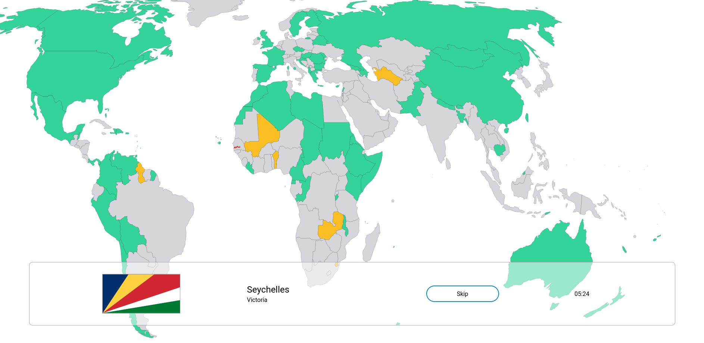

# UN-Members

A game to learn where all the member states of the United Nations are located.

## Contributing

Feel free to contribute to this project. You can take a look at the [todo list](todo.md) for ideas on what to work on.

## License

This project is licensed under the GPL-3.0 License.
